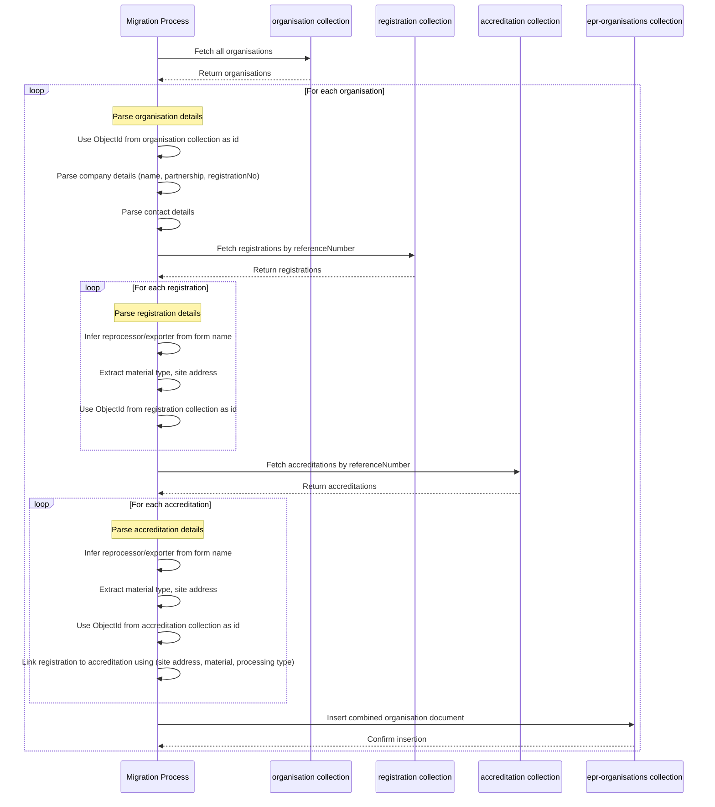

# Forms data logical data model

There is a set of forms provided to users as part of a contingency solution to apply for registration and accreditations.

This describes logical data model for storing data collected through forms for `organisation`, `registration`, `accreditation`

### Test env form urls

- [Organisation details](https://forms-runner.test.cdp-int.defra.cloud/form/preview/draft/demo-for-pepr-extended-producer-responsibilities-provide-your-organisation-details-ea/form-guidance)
- [Exporter registration](https://forms-runner.test.cdp-int.defra.cloud/form/preview/draft/demo-for-pepr-extended-producer-responsibilities-register-as-a-packaging-waste-exporter-ea/form-guidance)
- [Reprocessor registration](https://forms-runner.test.cdp-int.defra.cloud/form/preview/draft/demo-for-pepr-extended-producer-responsibilities-register-as-a-packaging-waste-reprocessor-ea/form-guidance)
- [Exporter accreditation](https://forms-runner.test.cdp-int.defra.cloud/form/preview/draft/demo-for-pepr-extended-producer-responsibilities-apply-for-accreditation-as-a-packaging-waste-exporter-ea/form-guidance)
- [Reprocessor accreditation](https://forms-runner.test.cdp-int.defra.cloud/form/preview/draft/demo-for-pepr-extended-producer-responsibilities-apply-for-accreditation-as-a-packaging-waste-reprocessor-ea/form-guidance)

## Logical Data Model (LDM)

```mermaid
erDiagram
  ORGANISATION {
    ObjectId _id PK "_id from organisation collection. This is system generated id from org form submission"
    int orgId "org id from organisation collection"
    enum status "created,approved,rejected,suspended,archived. The initial status created is system generated but afterwards driven by regulator decisions"
    STATUS-HISTORY[] statusHistory "Status change history"
    int schemaVersion "This is a system/technical field used for tracking schema versions"
    int version "Version of the document, this is a system/technical field. incremented during write and can be used for optimistic locking in future"
    enum[] wasteProcessingTypes "reprocessor, exporter"
    enum[] reprocessingNations "england,wales, scotland,northern_ireland"
    enum businessType "individual, unincorporated, partnership"
    COMPANY-DETAILS companyDetails
    PARTNERSHIP partnership "company partnership details"
    USER submitterContactDetails "Submitter details contact details"
    USER managementContactDetails "Contact details of the person who manage or control the organisation. This is applicable only when submitter doesnt manage or control the org"
    REGISTRATION[] registrations
    ACCREDITATION[] accreditations
    ISO8601 formSubmissionTime "Time at which form was submitted"
    enum submittedToRegulator "ea,nrw,sepa,niea"
  }


  REGISTRATION {
    ObjectId id  PK "_id from registration collection. This is system generated id from registration form submission"
    ISO8601 formSubmissionTime "Time at which form was submitted"
    enum submittedToRegulator "ea,nrw,sepa,niea"
    ISO8601 validFrom "regulator provided date from which registration is valid"
    ISO8601 validTo "regulator provided date till which registration is valid"
    enum status "created,approved,rejected,suspended,archived.The initial status created is system generated but afterwards driven by regulator decisions"
    string orgName "Name of organisation"
    STATUS-HISTORY[] statusHistory "Status change history"
    SITE site "applicable only for reprocessor"
    enum material "aluminium,fibre,glass,paper,plastic,steel,wood"
    enum wasteProcessingType "reprocessor, exporter. This might need to be parsed from form name or another field"
    ObjectId accreditationId FK "automatically linked when possible"
    enum[] recyclingProcess "glass_re_melt,glass_other"
    ADDRESS noticeAddress
    string wasteRegistrationNumber "waste carrier, broker or dealer registration number"
    WASTE-MANAGEMENT-PERMIT[] wasteManagementPermits "waste management permit or waste exemption details"
    USER[] approvedPersons "approved persons for this site"
    string suppliers "Waste supplier details. applicable only for exporter"
    string[] exportPorts "List of ports from which waste is exported."
    YEARLY-METRICS[] yearlyMetrics "Yearly metrics related to how much input is received, output produced etc..."
    string plantEquipmentDetails "a list of the key plant and equipment used for reprocessing. applicable only for reprocessor"
    USER submitterContactDetails "who submitted the application"
    FORM-FILE-UPLOAD[] samplingInspectionPlanFileUploads "sampling and inspection plan documents"
    FORM-FILE-UPLOAD[] orsFileUploads "overseas reprocessing and interim sites log documents"
  }

  FORM-FILE-UPLOAD{
    string defraFormUploadedFileId "id of file uploaded by user during form submission. This id is system generated by DEFRA forms"
    string defraFormUserDownloadLink "url to download file uploaded by user, to download successfully would need email id configured in form submission. This will deleted by defra-forms after 90 days"
    string s3Uri "The s3 URI where file is stored. The file is copied to new s3 location to keep it for longer than 90 days."
  }

  STATUS-HISTORY{
    enum status "created,approved,rejected,suspended,archived"
    ISO8601 updatedAt "At what time the status changed"
    USER updatedBy FK "who updated the status"
  }

  ACCREDITATION {
    ObjectId id PK "_id from accreditation collection. This is system generated id from accreditation form submission"
    string accreditationNumber "value assigned by regulators"
    enum submittedToRegulator "ea,nrw,sepa,niea"
    ISO8601 validFrom "regulator provided date from which accreditation is valid"
    ISO8601 validTo "regulator provided date till which accreditation is valid"
    string orgName "Name of organisation"
    ISO8601 formSubmissionTime "Time at which form was submitted"
    SITE site "applicable only for reprocessor"
    enum material "aluminium,fibre,glass,paper,plastic,steel,wood"
    enum wasteProcessingType "reprocessor, exporter. This might need to be parsed from form name or another field"
    enum status "created,approved,rejected,suspended,archived.The initial status created is system generated but afterwards driven by regulator decisions"
    STATUS-HISTORY[] statusHistory "Status change history"
    PRN-ISSUANCE prnIssuance "How much PRN will be issued"
    PERN-ISSUANCE pernIssuance "How much PERN will be issued"
    array businessPlan "object(description|detailedDescription|percentSpent)"
    ADDRESS noticeAddress
    USER submitterContactDetails "who submitted the application"
    FORM-FILE-UPLOAD[] samplingInspectionPlanFileUploads "sampling and inspection plan documents"
    FORM-FILE-UPLOAD[] orsFileUploads "overseas reprocessing and interim sites log documents"
  }

  PRN-ISSUANCE {
    string tonnageBand
    USER[] signatories
    json prnIncomeBusinessPlan "How the income from PRN will be used i.e percentIncomeSpent|usageDescription|detailedExplanation"
  }

  PERN-ISSUANCE {
    string tonnageBand
    USER[] signatories
    json pernIncomeBusinessPlan "How the income from PERN will be used i.e percentIncomeSpent|usageDescription|detailedExplanation"
  }


  YEARLY-METRICS {
    string year
    json input "Information about the input i.e type(actual|estimated)|ukPackagingWaste|nonUkPackagingWaste|nonPackagingWaste"
    json rawMaterialInputs "Details about any input during recycling i.e material|tonnage"
    json output "Information about the  output produced i.e type(actual|estimated)|sentToAnotherSite|contaminants|processLoss"
    json[] productsMadeFromRecycling "Details about any products made from recycling i.e name|weight"
  }

  WASTE-MANAGEMENT-PERMIT {
    enum type "wml,ppc,waste_exemption"
    string permitNumber
    WASTE_EXEMPTION[] exemptions "Waste exemptions obtained for the site"
    AUTHORISED-MATERIAL[] authorisedMaterials "List of materials this permit authorises"
  }

  AUTHORISED-MATERIAL {
    enum material "aluminium,fibre,glass,paper,plastic,steel,wood"
    enum authorisedWeight "in tonnes"
    enum timeScale "weekly, monthly, yearly"
  }

  SITE-CAPACITY{
    enum material "aluminium,fibre,glass,paper,plastic,steel,wood"
    string siteCapacityWeight "in tonnes"
    enum siteCapacityTimescale "weekly, monthly, yearly"
  }

  WASTE_EXEMPTION {
    string reference
    string exemptionCode
  }

  COMPANY-DETAILS {
    string name "Official company name"
    string tradingName "Trading name if different"
    string registrationNumber "Companies House number"
    ADDRESS registeredAddress
  }

  PARTNERSHIP {
    enum type "ltd,ltd_liability"
    PARTNER[] partners "List of partners"
  }

  PARTNER {
    string name
    enum type "company,individual"
  }

  SITE {
    ADDRESS address
    string gridReference "applicable only for reprocessor"
    SITE-CAPACITY[] siteCapacity "How much particular material site is authorised to process, how much it can process"
  }

  ADDRESS {
    string line1 "Address line 1"
    string line2 "Address line 2 (optional)"
    string town "Town or city"
    string county
    string country "Country (default: UK)"
    string postcode "Postal code"
    string region "State/region for non-UK"
    string fullAddress "If it cant be parsed"
    string line2ToCounty "If it cant be parsed"
  }

  USER {
    string fullName
    string email
    string phone
    string role
    string title
  }

  USER-LOGIN-DETAILS{
    ObjectId _id PK
    string defra_id "DEFRA id created for user logins"
    string email FK "email id submitted through forms"
  }

%% ORGANISATION relationships
  ORGANISATION ||--o| COMPANY-DETAILS: contains
  ORGANISATION ||--o| PARTNERSHIP: contains
  ORGANISATION ||--o| USER: contains
  ORGANISATION ||--o{ REGISTRATION: contains
  ORGANISATION ||--o{ ACCREDITATION: contains
  ORGANISATION ||--|{ STATUS-HISTORY: contains

%% REGISTRATION relationships
  REGISTRATION ||--|| SITE: contains
  REGISTRATION ||--|| USER: contains
  REGISTRATION ||--o{ WASTE-MANAGEMENT-PERMIT: contains
  REGISTRATION ||--o| YEARLY-METRICS: contains
  REGISTRATION ||--|{ STATUS-HISTORY: contains
  REGISTRATION ||--o{ USER: contains
  REGISTRATION ||--|{ FORM-FILE-UPLOAD: contains

%% ACCREDITATION relationships
  ACCREDITATION ||--|| SITE: contains
  ACCREDITATION ||--|| ADDRESS: contains
  ACCREDITATION ||--|| USER: contains
  ACCREDITATION ||--o| PRN-ISSUANCE: contains
  ACCREDITATION ||--o| PERN-ISSUANCE: contains
  ACCREDITATION ||--|{ STATUS-HISTORY: contains
  ACCREDITATION ||--|{ FORM-FILE-UPLOAD: contains

%% Supporting entity relationships
  COMPANY-DETAILS ||--o| ADDRESS: contains
  PARTNERSHIP ||--o{ PARTNER: contains
  SITE ||--|| ADDRESS: contains
  SITE ||--o{ SITE-CAPACITY: contains
  WASTE-MANAGEMENT-PERMIT ||--o{ WASTE_EXEMPTION: contains
  WASTE-MANAGEMENT-PERMIT  ||--|{ AUTHORISED-MATERIAL: contains
  PRN-ISSUANCE ||--o{ USER: contains
  PERN-ISSUANCE ||--o{ USER: contains
  USER ||--o| USER-LOGIN-DETAILS: contains
  STATUS-HISTORY   ||--|{ USER: contains
```



### Example data using LDM

```json
{
  "_id": "6507f1f77bcf86cd79943901",
  "orgId": "50002",
  "schemaVersion": 1,
  "version": 1,
  "wasteProcessingTypes": ["reprocessor", "exporter"],
  "reprocessingNations": ["england", "wales"],
  "businessType": "partnership",
  "submittedToRegulator": "ea",
  "statusHistory": [
    {
      "status": "created",
      "updatedAt": "2025-08-22T19:34:44.944Z",
      "updatedBy": {
        "email": "test@corpo.com"
      }
    }
  ],
  "registrations": [
    {
      "id": "6507f1f77bcf86cd79943902",
      "status": "created",
      "submittedToRegulator": "ea",
      "orgName": "ACME ltd",
      "statusHistory": [
        {
          "status": "created",
          "updatedAt": "2025-08-22T19:34:44.944Z",
          "updatedBy": {
            "email": "test@corpo.com"
          }
        }
      ],
      "formSubmissionTime": "2025-08-20T19:34:44.944Z",
      "site": {
        "address": {
          "line1": "7 Glass processing site",
          "town": "London",
          "postcode": "SW2A 0AA"
        },
        "siteCapacity": [
          {
            "material": "glass",
            "authorisedWeight": "10",
            "authorisedTimeScale": "yearly",
            "siteCapacityWeight": "15",
            "siteCapacityTimescale": "yearly"
          }
        ]
      },
      "material": "glass",
      "wasteProcessingType": "reprocessor",
      "accreditationId": "04de8fb2-2dab-48ad-a203-30a80f595c0b",
      "gridReference": "123455",
      "wasteRegistrationNumber": "CBDU123456",
      "wasteManagementPermits": [
        {
          "type": "wml",
          "permitNumber": "WML123456",
          "permittedMaterials": ["glass"],
          "permitWindow": "yearly"
        }
      ],
      "approvedPersons": [
        {
          "fullName": "Luke Skywalker",
          "email": "luke.skywalker@starwars.com",
          "title": "Director",
          "phone": "1234567890"
        }
      ],
      "noticeAddress": {
        "line1": "7 Glass processing site",
        "town": "London",
        "postcode": "SW2A 0AA"
      }
    },
    {
      "id": "dc60a427-3bfa-4092-9282-bc533e4213f9",
      "status": "created",
      "submittedToRegulator": "ea",
      "orgName": "ACME ltd",
      "statusHistory": [
        {
          "status": "created",
          "updatedAt": "2025-08-22T19:34:44.944Z",
          "updatedBy": {
            "email": "test@corpo.com"
          }
        }
      ],
      "formSubmissionTime": "2025-08-21T19:34:44.944Z",
      "material": "plastic",
      "wasteProcessingType": "exporter",
      "wasteRegistrationNumber": "CBDU123456",
      "wasteManagementPermits": [
        {
          "type": "wml",
          "permitNumber": "WML123456",
          "permittedMaterials": ["plastic"],
          "permitWindow": "yearly"
        }
      ],
      "approvedPersons": [
        {
          "fullName": "Luke Skywalker",
          "email": "anakin.skywalker@starwars.com",
          "title": "Partner",
          "phone": "823456789"
        }
      ],
      "noticeAddress": {
        "line1": "7 Glass processing site",
        "town": "London",
        "postcode": "SW2A 0AA"
      }
    }
  ],
  "accreditations": [
    {
      "id": "04de8fb2-2dab-48ad-a203-30a80f595c0b",
      "formSubmissionTime": "2025-08-20T21:34:44.944Z",
      "status": "created",
      "submittedToRegulator": "ea",
      "orgName": "ACME ltd",
      "statusHistory": [
        {
          "status": "created",
          "updatedAt": "2025-08-22T19:34:44.944Z",
          "updatedBy": {
            "email": "test@corpo.com"
          }
        }
      ],
      "site": {
        "address": {
          "line1": "7 Glass processing site",
          "postcode": "SW2A 0AA"
        }
      },
      "material": "glass",
      "wasteProcessingType": "reprocessor",
      "prnIssuance": {
        "plannedIssuance": "10000 tonnes",
        "signatories": [
          {
            "fullName": "Yoda",
            "email": "yoda@starwars.com",
            "title": "PRN signatory",
            "phone": "1234567890"
          }
        ],
        "prnIncomeBusinessPlan": [
          {
            "description": "New reprocessing infrastructure and maintaining existing infrastructure",
            "detailedDescription": "Investing on buying to machine to separate glass from waste",
            "percentSpent": 20
          }
        ]
      },
      "noticeAddress": {
        "line1": "7 Glass processing site",
        "town": "London",
        "postcode": "SW2A 0AA"
      }
    },
    {
      "id": "26673c70-5f03-4865-a796-585ef4ddca30",
      "status": "created",
      "submittedToRegulator": "ea",
      "orgName": "ACME ltd",
      "statusHistory": [
        {
          "status": "created",
          "updatedAt": "2025-08-22T19:34:44.944Z",
          "updatedBy": {
            "email": "test@corpo.com"
          }
        }
      ],
      "site": {
        "address": {
          "line1": "7",
          "postcode": "SW2A 0AA"
        }
      },
      "material": "glass",
      "wasteProcessingType": "reprocessor",
      "prnIssuance": {
        "plannedIssuance": "10000 tonnes",
        "signatories": [
          {
            "fullName": "Yoda",
            "email": "yoda@starwars.com",
            "title": "PRN signatory",
            "phone": "1234567890"
          }
        ],
        "prnIncomeBusinessPlan": [
          {
            "description": "New reprocessing infrastructure and maintaining existing infrastructure",
            "detailedDescription": "Investing on buying to machine to separate glass from waste",
            "percentSpent": 20
          }
        ]
      },
      "noticeAddress": {
        "line1": "7a",
        "town": "London",
        "postcode": "SW2A 0AA"
      }
    },
    {
      "id": "dc60a427-3bfa-4092-9282-bc533e4213f9",
      "status": "created",
      "submittedToRegulator": "ea",
      "orgName": "ACME ltd",
      "statusHistory": [
        {
          "status": "created",
          "updatedAt": "2025-08-22T19:34:44.944Z",
          "updatedBy": {
            "email": "test@corpo.com"
          }
        },
        {
          "status": "rejected",
          "updatedAt": "2025-08-25T19:34:44.944Z",
          "updatedBy": {
            "email": "test@corpo.com"
          }
        }
      ],
      "material": "plastic",
      "wasteProcessingType": "exporter",
      "prnIssuance": {
        "plannedIssuance": "300 tonnes",
        "signatories": [
          {
            "fullName": "Princess Leia",
            "email": "princess.leia@starwars.com",
            "title": "PRN signatory",
            "phone": "7234567890"
          }
        ],
        "prnIncomeBusinessPlan": [
          {
            "description": "New vehicle to transport",
            "percentSpent": 10
          }
        ]
      },
      "noticeAddress": {
        "line1": "7a",
        "town": "London",
        "postcode": "SW2A 0AA"
      }
    }
  ],
  "companyDetails": {
    "name": "ACME ltd",
    "tradingName": "ACME ltd",
    "registrationNumber": "AC012345",
    "registeredAddress": {
      "line1": "Palace of Westminster",
      "town": "London",
      "postcode": "SW1A 0AA"
    }
  }
}
```

## Converting forms data into logical data model

The data submitted from forms is stored in three MongoDB collections: `organisation`, `registration`, `accreditation`. It's stored as a list of answers from forms and raw submission data as JSON.

Example data from form submissions is available in [Sample form data](../../../src/data/fixtures/).

This data needs to be parsed and stored in the logical model proposed above:

- Fetch all submissions from the organisation collection. Parse required fields (company name, address, etc.)
- Parsing should take into account questions being worded slightly differently across different nation (England, Wales, Scotland, NI) forms
- For each organisation, fetch all registrations and accreditations using the referenceNumber
- Parse required fields from registrations and accreditations (material, site address, etc.). Whether the submission is for a reprocessor or exporter might have to be inferred from the form name
- Generate a unique id using ObjectId for each registration/accreditation
- Link registration ID to accreditation ID using "1st line of address, postcode, material, wasteProcessingType"

### ID generation for registration and accreditation

There were two options considered

1. Generate uuid from "site address, material, wasteProcessingType, form submission time". Form submission time is used to account for duplicate form submissions. This has the advantage of ensuring uniqueness at db level.
2. Generate a random unique id using ObjectId. At code level validation should be done to make sure duplicate ids are not generated for same registrations if form data is replayed.

Option #2 has been chosen as option #1 would make it difficult to evolve list of fields that constitute a unique registration

### Linking registrations to accreditations

There were two options considered for modelling registrations and accreditations:

1. Store both under a single WasteOperations object within the organisation. Waste operations are identified by combination of "material, reprocessor/exporter, site address (line1, postcode)". This means registration and accreditation for the same waste operation are stored together and easy to link. However, the problem is that users can submit slightly different data in registration/accreditation forms. For example, a user provides the first line of address as "171 street" during registration and during accreditation as "171". Users might also submit duplicate forms, in which case data has to be deduplicated.

2. Store registrations and accreditations as separate arrays under organisations. Generate a unique id for registration/accreditation using ObjectId. Automatically link registration to accreditation when "material, reprocessor/exporter, site address (line1, postcode)" matches. When it doesn't match, linking has to be resolved from the admin UI. There has to be logic to ensure any write operation doesn't leave registration to accreditation linkage invalid. For example, site address being updated in registration object.

Option 2 has been chosen as it handles users submitting slightly different data between registration/accreditation and duplicate submissions.

### Site modelling approach

Registrations and accreditations are **not** modelled as children of Site (which itself is a child of Organisation). This design decision is based on the following considerations:

#### 1. Data Integrity and Reconciliation

Reprocessors handling multiple materials at a single site submit multiple forms: `number of materials × 2 (one registration and one accreditation per material)`. Most reprocessors will submit at least two forms.

When address details vary slightly across these submissions, attempting to automatically link them to a single Site entity becomes problematic. Instead, we store the data exactly as submitted and perform reconciliation through the admin UI, preserving the original submission data.

#### 2. Inconsistent Site Concepts Across reprocessors/exporters

- **Reprocessors** have physical site addresses where processing occurs
- **Exporters** operate from ports, which are identified by name rather than physical addresses

If we modelled registrations/accreditations as Site children, we would need two different parent structures:

- Reprocessors: Organisation → Site → Registration/Accreditation
- Exporters: Organisation → Registration/Accreditation (no Site entity)

To maintain consistency and simplicity, registrations and accreditations are linked to a Site entity that is identified by its address details. This provides a cleaner data model while accommodating both reprocessors/exporters and allowing for post-submission reconciliation.

### Status History

The `statusHistory` field tracks all status changes for organisations, registrations, and accreditations. This is particularly important for accreditations to determine if they were active at a given point in time.

#### How It Works

- **Initial creation**: When created, an entry with status `"created"` and current timestamp is added
- **Status changes**: Every time status changes, a new entry is appended with the new status and timestamp
- **Immutable**: Existing entries are never modified, only new entries are added

#### Determining Active Periods

```javascript
// Check if accreditation was active on a specific date
const wasActiveOn = (accreditation, targetDate) => {
  const statusAt = accreditation.statusHistory
    .sort((a, b) => new Date(a.updatedAt) - new Date(b.updatedAt))
    .filter((entry) => new Date(entry.updatedAt) <= targetDate)
    .pop()

  return statusAt?.status === 'approved'
}
```

### Schema version

Schema changes will be versioned and stored at record level.

### Document version field

The version field will start from 1(insert) then get incremented for every update. It can be used for optimistic locking in future

### Creating new collection

Create a new collection to store combined data from `organisation`, `registration`, `accreditation`. This means original data remain intact if needed.

As organisation collection name is already used, there are two options available

1. rename existing collections to `organisation_forms`, `registration_forms`, `accreditation_forms` and use organisation as new collection name.
   This can be done in straightforward manner with downtime. A bit more involved to deploy renaming without downtime
   One option is to deploy code change to fall back to new name if old name doesn't exist then deploy name change
2. Use epr-organisations for new collection

Option #2 has been chosen as its less risky and taking account of delivery timelines

### Sequence diagram for converting to logical data model



## Assumptions

- System will not deduplicate data across form submissions. Logical data model will store data submitted as its from forms and then potentially update anything incorrect from admin UI.
- Registration needs to be renewed every year, accreditation needs to be applied every year. For now its assumed system is tracking current registration/accreditations and not storing for which year its applicable
- How to model users and their DEFRA logins needs to be investigated separately. Users can potentially be identified by email.id.
  This is relevant when regulator approves registration/accreditation and defra id needs to be created and emailed to them.
  The lineage between defra id and email id(or whatever is decided to link approved person/prn signatory to defra id) needs to be stored.
