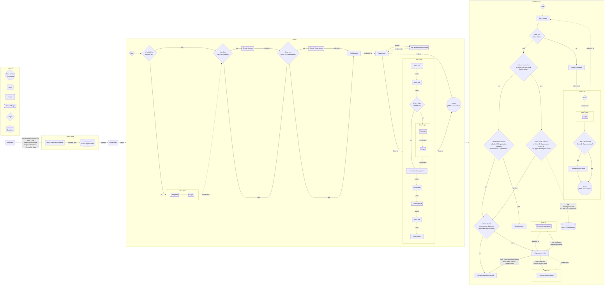

# pEPR Low Level Design Auth UI

```mermaid
flowchart LR
  %% Users
  regulator_1(Regulator)
  peprServiceMaintainer_1(pEPR Service Maintainer)
  initialUser_1(Initial User)
  initialUser_2(Initial User)
  otherUser_1(New User)
  otherUser_2(New User)

  %% Systems
  peprDatabase_1[(pEPR Organisations)]
  peprDatabase_2[(pEPR Organisations)]

  %% Pages: Start
    %% One Login
    oneLogin_register_1>Register]
    oneLogin_login_1>Login]
    oneLogin_register_2>Register]
    oneLogin_login_2>Login]
    oneLogin_login_3>Login]

    %% Defra ID
    defraId_createAccount_1>Create Account]
    defraId_createOrganisation_1>Create Organisation]
    defraId_createOrganisation_2>Create Organisation]
    defraId_addOrganisation_1>Add another Organisation]
    defraId_chooseOrganisation_1[Choose Organisation]
    defraId_chooseOrganisation_2[Choose Organisation]
    defraId_addService_1[Add Service]
    defraId_dashboard_1[Dashboard]
    defraId_dashboard_2[Dashboard]
    defraId_addUser_1[Add User]
    defraId_userPending_1[User pending approval]
    defraId_userApproval_1>User approval]

    %% pEPR Service
    pepr_Authenticate[Authenticate]
    pepr_unauthenticated[Unauthenticated]
    pepr_unauthorised[Unauthorised]
    pepr_organisationList[Organisation List]
    pepr_organisationDashboard[Organisation Dashboard]

  %% Pages: End

  %% Terminals
  defraId_start_1((Start))
  defraId_start_2((Start))
  defraId_exit_1((Go to:<br> pEPR Service Start))
  defraId_exit_3((Go to:<br> pEPR Service Start))
  pepr_start((Start))

  %% Decisions
  defraId_loggedIn_1{ Is Initial User<br> Logged In? }
  defraId_loggedIn_2{ Is New User<br> Logged In? }
  defraId_hasAccount_1{ User has<br> Defra ID Account? }
  defraId_hasOrganisation_1{ User has<br> Defra ID Organisation? }
  defraId_hasMultipleAccounts_1{ User has multiple<br> Defra ID Organisations? }
  pepr_hasValidToken{ User has<br> Valid Token? }
  pepr_isUserNamedOnAtLeastOneOrganisation{ Is User named on<br> at least one approved Organisation? }
  pepr_doesTokenContainAccountLinkedToOrganisation_1{ Does token contain<br> a Defra ID Organisation linked to<br> an approved Organisation? }
  pepr_doesTokenContainAccountLinkedToOrganisation_2{ Does token contain<br> a Defra ID Organisation linked to<br> an approved Organisation? }
  pepr_isUserAbleToAccessMoreThanOneOrganisation{ Is User able to<br> access more than one<br> approved Organisation? }

  %% Flows
  regulator_1-- provides applications info:<br> Initial User,<br> Approvals Statuses,<br> Reg/Acc Numbers,<br> changelog data -->
      groupInitialLoad

  subgraph Legend
    direction LR
    startEnd((Start or End<br> of process))
    actor(Actor)
    page[Page]
    flow>Flow of Pages]
    logic{ Logic }
    database[(Database)]
  end

  subgraph groupInitialLoad[Initial Load]
    direction LR
    peprServiceMaintainer_1--imports data-->
        peprDatabase_1
  end

  groupInitialLoad--notifies-->
      initialUser_1--visits-->
          groupDefraId

  subgraph groupDefraId[Defra ID]
    direction LR
    defraId_start_1-->
        defraId_loggedIn_1-- no -->
            oneLogin_initialUser

    subgraph oneLogin_initialUser[One Login]
      direction LR
      oneLogin_register_1-->
          oneLogin_login_1
    end

    oneLogin_initialUser-. redirects to .->
        defraId_hasAccount_1

    defraId_loggedIn_1-- yes -->
        defraId_hasAccount_1-- no -->
            defraId_createAccount_1-- redirects to-->
                defraId_hasOrganisation_1
        defraId_hasAccount_1-- yes -->
            defraId_hasOrganisation_1-- no -->
                defraId_createOrganisation_1-- redirects to-->
                    defraId_addService_1
            defraId_hasOrganisation_1-- yes -->
                defraId_addService_1-. redirects to .->
                    defraId_dashboard_1-- links to -->
                        groupDefraId_addUser
                    defraId_dashboard_1-- links to -->
                        defraId_addOrganisation_1-. redirects to .->
                            defraId_dashboard_1

    subgraph groupDefraId_addUser[Add User]
      direction TB
      defraId_addUser_1-- notifies -->
          otherUser_1-- visits -->
              defraId_loggedIn_2-- no -->
                  oneLogin_otherUser-. redirects to .->
                      defraId_userPending_1-- notifies -->
                          initialUser_2-- visits -->
                              defraId_userApproval_1-- notifies -->
                                  otherUser_2-- visits -->
                                      defraId_dashboard_2
              defraId_loggedIn_2-- yes -->
                  defraId_userPending_1

      subgraph oneLogin_otherUser[One Login]
        direction TB
        oneLogin_register_2-. redirects to .->oneLogin_login_2
      end
    end

    groupDefraId_addUser-- links to -->defraId_exit_1

    defraId_dashboard_1-- links to -->defraId_exit_1

  end

  groupDefraId-->peprServiceSingleOrganisation

  subgraph peprServiceSingleOrganisation[pEPR Service]
    pepr_start-->
      pepr_Authenticate-->
          pepr_hasValidToken-- no -->
              pepr_unauthenticated
          pepr_hasValidToken-- yes -->
              pepr_isUserNamedOnAtLeastOneOrganisation-- no -->
                  pepr_doesTokenContainAccountLinkedToOrganisation_1-- no -->
                      pepr_unauthorised
                  pepr_doesTokenContainAccountLinkedToOrganisation_1-- yes -->
                      pepr_isUserAbleToAccessMoreThanOneOrganisation
              pepr_isUserNamedOnAtLeastOneOrganisation-- yes -->
                  pepr_doesTokenContainAccountLinkedToOrganisation_2-. no:<br> link Organisation<br> to Defra ID Organisation .->
                      peprDatabase_2
                  pepr_doesTokenContainAccountLinkedToOrganisation_2-- yes/no -->
                      pepr_isUserAbleToAccessMoreThanOneOrganisation-- no -->
                          pepr_organisationDashboard
                      pepr_isUserAbleToAccessMoreThanOneOrganisation-- yes -->
                          pepr_organisationList-- user clicks on Organisation<br> for current Defra ID Organisation -->
                              pepr_organisationDashboard
                          pepr_organisationList-- user clicks on<br> #quot;switch Organisation#quot; -->
                              groupDefraId_chooseAccount-. redirects to .->
                                  pepr_organisationList
                          pepr_organisationList-- user clicks on<br> #quot;add Organisation#quot; -->
                              groupDefraId_createAccount-. redirects to .->
                                  pepr_organisationList

      subgraph groupDefraId_authenticate[Defra ID]
        direction TB
        defraId_start_2-. redirects to .->oneLogin_loginFlow

        subgraph oneLogin_loginFlow[One Login]
          direction LR
          oneLogin_login_3
        end

        oneLogin_loginFlow-->defraId_hasMultipleAccounts_1
        defraId_hasMultipleAccounts_1-- yes -->defraId_chooseOrganisation_1
        defraId_chooseOrganisation_1-->defraId_exit_3
        defraId_hasMultipleAccounts_1-- no -->defraId_exit_3
      end

      pepr_unauthenticated-. redirects to .->groupDefraId_authenticate
      groupDefraId_authenticate-. redirects to .->pepr_Authenticate


    subgraph groupDefraId_chooseAccount[Defra ID]
      direction LR
      defraId_chooseOrganisation_2
    end

    subgraph groupDefraId_createAccount[Defra ID]
      direction LR
      defraId_createOrganisation_2
    end
  end
```
