# pEPR Low Level Design Auth UI

```mermaid
flowchart LR
  %% Users
  regulator(Regulator)
  peprServiceMaintainer(pEPR Service Maintainer)
  initialUser_1(Initial User)
  initialUser_2(Initial User)
  otherUser_1(New User)
  otherUser_2(New User)

  %% Systems
  peprDatabase_1[(pEPR Organisations)]
  peprDatabase_2[(pEPR Organisations)]

  %% Pages: Start
    %% One Login
    oneLogin_register_1>Register]
    oneLogin_login_1>Login]
    oneLogin_register_2>Register]
    oneLogin_login_2>Login]
    oneLogin_login_3>Login]

    %% Defra ID
    defraId_createAccount>Create Account]
    defraId_createOrganisation_1>Create Organisation]
    defraId_createOrganisation_2>Create Organisation]
    defraId_addOrganisation>Add another Organisation]
    defraId_chooseOrganisation_1[Choose Organisation]
    defraId_chooseOrganisation_2[Choose Organisation]
    defraId_addService[Add Service]
    defraId_dashboard_1[Dashboard]
    defraId_dashboard_2[Dashboard]
    defraId_addUser[Add User]
    defraId_userPending[User pending approval]
    defraId_userApproval>User approval]

    %% pEPR Service
    pepr_authenticate[Authenticate]
    pepr_unauthenticated[Unauthenticated]
    pepr_unauthorised[Unauthorised]
    pepr_confirmOrganisation[Confirm Organisation]
    pepr_organisationList[Organisation List]
    pepr_organisationDashboard[Organisation Dashboard]

  %% Pages: End

  %% Terminals
  defraId_start_1((Start))
  defraId_start_2((Start))
  defraId_exit_1((Go to:<br> pEPR Service Start))
  defraId_exit_3((Go to:<br> pEPR Service Start))
  pepr_start((Start))

  %% Decisions
  defraId_loggedIn_1{ Is Initial User<br> Logged In? }
  defraId_loggedIn_2{ Is New User<br> Logged In? }
  defraId_hasAccount{ User has<br> Defra ID Account? }
  defraId_hasOrganisation{ User has<br> Defra ID Organisation? }
  defraId_isAdminForOrganisation{ User is Admin for<br> Defra ID Organisation? }
  defraId_hasMultipleAccounts{ User has multiple<br> Defra ID Organisations? }
  pepr_hasValidToken{ User has<br> Valid Token? }
  pepr_isCurrentRelationshipLinkedOrganisation{ Does token contain a current<br> Defra ID Organisation Id found<br> in approved pEPR Organisations? }
  pepr_isUserNamedOnAtLeastOneOrganisation{ Is the User an InitialUser<br> on at least one approved<br> pEPR Organisation? }
  pepr_hasUserConfirmedOrganisationLink{ Has User confirmed<br> Organisation link? }

  %% Flows
  regulator-- provides applications info:<br> Initial User,<br> Approvals Statuses,<br> Reg/Acc Numbers,<br> changelog data -->
      groupInitialLoad

  subgraph Legend
    direction LR
    startEnd((Start or End<br> of process))
    actor(Actor)
    page[Page]
    flow>Flow of Pages]
    logic{ Logic }
    database[(Database)]
  end

  subgraph groupInitialLoad[Initial Load]
    direction LR
    peprServiceMaintainer--imports data-->
        peprDatabase_1
  end

  groupInitialLoad--notifies-->
      initialUser_1--visits-->
          groupDefraId

  subgraph groupDefraId[Defra ID]
    direction LR
    defraId_start_1-->
        defraId_loggedIn_1-- no -->
            oneLogin_initialUser

    subgraph oneLogin_initialUser[One Login]
      direction LR
      oneLogin_register_1-->
          oneLogin_login_1
    end

    oneLogin_initialUser-. redirects to .->
        defraId_hasAccount

    defraId_loggedIn_1-- yes -->
        defraId_hasAccount-- no -->
            defraId_createAccount-- redirects to-->
                defraId_createOrganisation_1-- redirects to-->
                    defraId_addService
        defraId_hasAccount-- yes -->
            defraId_hasOrganisation-- no -->
                defraId_createOrganisation_1
            defraId_hasOrganisation-- yes -->
                defraId_isAdminForOrganisation-- no -->
                    askForAdminAccess[End of Journey: Ask for Admin access]
                defraId_isAdminForOrganisation-- yes -->
                    defraId_addService-. redirects to .->
                        defraId_dashboard_1-- links to -->
                            groupDefraId_addUser
                        defraId_dashboard_1-- links to -->
                            defraId_addOrganisation-. redirects to .->
                                defraId_dashboard_1

    subgraph groupDefraId_addUser[Add User]
      direction TB
      defraId_addUser-- notifies -->
          otherUser_1-- visits -->
              defraId_loggedIn_2-- no -->
                  oneLogin_otherUser-. redirects to .->
                      defraId_userPending-- notifies -->
                          initialUser_2-- visits -->
                              defraId_userApproval-- notifies -->
                                  otherUser_2-- visits -->
                                      defraId_dashboard_2
              defraId_loggedIn_2-- yes -->
                  defraId_userPending

      subgraph oneLogin_otherUser[One Login]
        direction TB
        oneLogin_register_2-. redirects to .->oneLogin_login_2
      end
    end

    groupDefraId_addUser-- links to -->defraId_exit_1

    defraId_dashboard_1-- links to -->defraId_exit_1

  end

  groupDefraId-->peprServiceSingleOrganisation

  subgraph peprServiceSingleOrganisation[pEPR Service]
    pepr_start-->
      pepr_authenticate-->
          pepr_hasValidToken-- no -->
              pepr_unauthenticated
          pepr_hasValidToken-- yes -->
              pepr_isCurrentRelationshipLinkedOrganisation-- no -->
                  pepr_isUserNamedOnAtLeastOneOrganisation-- no -->
                      pepr_unauthorised
                  pepr_isUserNamedOnAtLeastOneOrganisation-- yes -->
                      pepr_confirmOrganisation-->
                          pepr_hasUserConfirmedOrganisationLink-- no: switch Organisation -->
                              groupDefraId_chooseAccount-. redirects to .->
                                  pepr_authenticate
                          pepr_hasUserConfirmedOrganisationLink-- no: add Organisation -->
                              groupDefraId_createAccount-. redirects to .->
                                  pepr_authenticate
                          pepr_hasUserConfirmedOrganisationLink-. yes: link pEPR Organisation<br> to Defra ID Organisation .->
                              peprDatabase_2
                          pepr_hasUserConfirmedOrganisationLink-- yes -->
                              pepr_organisationDashboard
              pepr_isCurrentRelationshipLinkedOrganisation-- yes -->
                  pepr_organisationDashboard

      subgraph groupDefraId_authenticate[Defra ID]
        direction TB
        defraId_start_2-. redirects to .->oneLogin_loginFlow

        subgraph oneLogin_loginFlow[One Login]
          direction LR
          oneLogin_login_3
        end

        oneLogin_loginFlow-->defraId_hasMultipleAccounts
        defraId_hasMultipleAccounts-- yes -->defraId_chooseOrganisation_1
        defraId_chooseOrganisation_1-->defraId_exit_3
        defraId_hasMultipleAccounts-- no -->defraId_exit_3
      end

      pepr_unauthenticated-. redirects to .->groupDefraId_authenticate
      groupDefraId_authenticate-. redirects to .->pepr_authenticate


    subgraph groupDefraId_chooseAccount[Defra ID]
      direction TB
      defraId_chooseOrganisation_2
    end

    subgraph groupDefraId_createAccount[Defra ID]
      direction LR
      defraId_createOrganisation_2
    end
  end
```

## Single organisation:

### Confirm Organisation

We've found a potential match for your organisation

#### Your Organisation

ABC Limited

#### Organisation data in this Service

Name: **ABC LTD**

Org ID: **500001**

System Reference Number: **6507f1f77bcf86cd79943900**

[This is correct](/)

[This is incorrect](/)

---

## Multiple organisations:

## Confirm Organisation

We've found a list of potential matches for your organisation

### Your Organisation

ABC Limited

### Organisation data

| Org Name | OrgId  | System Reference Number  | Action    |
| -------- | ------ | ------------------------ | --------- |
| ABC LTD  | 500001 | 6507f1f77bcf86cd79943900 | [Link](/) |
| ABC LTD  | 500001 | 6507f1f77bcf86cd79943900 | [Link](/) |
