# pEPR Low Level Design: Auth UI

This document describes the Authentication and Authorisation processes from the main public-facing UI for the pEPR RE/EX project.

## Assumptions

1. Defra ID is a mandated part of the solution
2. That Defra ID supports multiple Identity Providers, a decision on which to use is not yet final but it seems likely that we will only use One Login
3. Defra ID does not yet support the ability to verify that a user legitimately represents an Organisation, we therefore must authorise their access to data previously submitted about that Organisation
4. That we will have an Admin UI for the purposes of:
   1. Editing the status of Organisations, Registrations & Accreditations in our database to "approved" so that they can be accessed by authorised users
   2. Viewing/Adding/Editing Users associated with an Organisation

```mermaid
flowchart LR
  %% Users
  regulator(Regulator)
  peprServiceMaintainer(pEPR Service Maintainer)
  initialUser_1(Initial User)
  initialUser_2(Initial User)
  otherUser_1(New User)
  otherUser_2(New User)

  %% Systems
  peprDatabase_1[(pEPR Organisations)]
  peprDatabase_2[(pEPR Organisations)]

  %% Pages: Start
    %% One Login
    oneLogin_register_1>Register]
    oneLogin_login_1>Login]
    oneLogin_register_2>Register]
    oneLogin_login_2>Login]
    oneLogin_login_3>Login]

    %% Defra ID
    defraId_createAccount>Create Account]
    defraId_createOrganisation_1>Create Organisation]
    defraId_createOrganisation_2>Create Organisation]
    defraId_addOrganisation>Add another Organisation]
    defraId_chooseOrganisation_1[Choose Organisation]
    defraId_chooseOrganisation_2[Choose Organisation]
    defraId_addService[Add Service]
    defraId_dashboard_1[Dashboard]
    defraId_dashboard_2[Dashboard]
    defraId_addUser[Add User]
    defraId_userPending[User pending approval]
    defraId_userApproval>User approval]

    %% pEPR Service
    pepr_authenticate[Authenticate]
    pepr_unauthenticated[Unauthenticated]
    pepr_unauthorised[Unauthorised]
    pepr_confirmOrganisation[Confirm Organisation]
    pepr_organisationDashboard[Organisation Dashboard]

  %% Pages: End

  %% Terminals
  defraId_start_1((Start))
  defraId_start_2((Start))
  defraId_exit_1((Go to:<br> pEPR Service Start))
  defraId_exit_3((Go to:<br> pEPR Service Start))
  pepr_start((Start))

  %% Decisions
  defraId_loggedIn_1{ Is Initial User<br> Logged In? }
  defraId_loggedIn_2{ Is New User<br> Logged In? }
  defraId_hasAccount{ User has<br> Defra ID Account? }
  defraId_hasOrganisation{ User has<br> Defra ID Organisation? }
  defraId_isAdminForOrganisation{ User is Admin for<br> Defra ID Organisation? }
  defraId_hasMultipleAccounts{ User has multiple<br> Defra ID Organisations? }
  pepr_hasValidToken{ User has<br> Valid Token? }
  pepr_isCurrentRelationshipLinkedOrganisation{ Does token contain a current<br> Defra ID Organisation Id found<br> in approved pEPR Organisations? }
  pepr_isUserNamedOnAtLeastOneOrganisation{ Is the User an InitialUser<br> on at least one approved<br> pEPR Organisation? }
  pepr_hasUserConfirmedOrganisationLink{ Has User confirmed<br> Organisation link? }

  %% Flows
  regulator-- provides applications info:<br> Initial User,<br> Approvals Statuses,<br> Reg/Acc Numbers,<br> changelog data -->
      groupInitialLoad

  subgraph Legend
    direction LR
    startEnd((Start or End<br> of process))
    actor(Actor)
    page[Page]
    flow>Flow of Pages]
    logic{ Logic }
    database[(Database)]
  end

  subgraph groupInitialLoad[Initial Load]
    direction LR
    peprServiceMaintainer--imports data-->
        peprDatabase_1
  end

  groupInitialLoad--notifies-->
      initialUser_1--visits-->
          groupDefraId

  subgraph groupDefraId[Defra ID]
    direction LR
    defraId_start_1-->
        defraId_loggedIn_1-- no -->
            oneLogin_initialUser

    subgraph oneLogin_initialUser[One Login]
      direction LR
      oneLogin_register_1-->
          oneLogin_login_1
    end

    oneLogin_initialUser-. redirects to .->
        defraId_hasAccount

    defraId_loggedIn_1-- yes -->
        defraId_hasAccount-- no -->
            defraId_createAccount-- redirects to-->
                defraId_createOrganisation_1-- redirects to-->
                    defraId_addService
        defraId_hasAccount-- yes -->
            defraId_hasOrganisation-- no -->
                defraId_createOrganisation_1
            defraId_hasOrganisation-- yes -->
                defraId_isAdminForOrganisation-- no -->
                    askForAdminAccess[End of Journey: Ask for Admin access]
                defraId_isAdminForOrganisation-- yes -->
                    defraId_addService-. redirects to .->
                        defraId_dashboard_1-- links to -->
                            groupDefraId_addUser
                        defraId_dashboard_1-- links to -->
                            defraId_addOrganisation-. redirects to .->
                                defraId_dashboard_1

    subgraph groupDefraId_addUser[Add User]
      direction TB
      defraId_addUser-- notifies -->
          otherUser_1-- visits -->
              defraId_loggedIn_2-- no -->
                  oneLogin_otherUser-. redirects to .->
                      defraId_userPending-- notifies -->
                          initialUser_2-- visits -->
                              defraId_userApproval-- notifies -->
                                  otherUser_2-- visits -->
                                      defraId_dashboard_2
              defraId_loggedIn_2-- yes -->
                  defraId_userPending

      subgraph oneLogin_otherUser[One Login]
        direction TB
        oneLogin_register_2-. redirects to .->oneLogin_login_2
      end
    end

    groupDefraId_addUser-- links to -->defraId_exit_1

    defraId_dashboard_1-- links to -->defraId_exit_1

  end

  groupDefraId-->peprServiceSingleOrganisation

  subgraph peprServiceSingleOrganisation[pEPR Service]
    pepr_start-->
      pepr_authenticate-->
          pepr_hasValidToken-- no -->
              pepr_unauthenticated
          pepr_hasValidToken-- yes -->
              pepr_isCurrentRelationshipLinkedOrganisation-- no -->
                  pepr_isUserNamedOnAtLeastOneOrganisation-- no -->
                      pepr_unauthorised
                  pepr_isUserNamedOnAtLeastOneOrganisation-- yes -->
                      pepr_confirmOrganisation-->
                          pepr_hasUserConfirmedOrganisationLink-- no: switch Organisation -->
                              groupDefraId_chooseAccount-. redirects to .->
                                  pepr_authenticate
                          pepr_hasUserConfirmedOrganisationLink-- no: add Organisation -->
                              groupDefraId_createAccount-. redirects to .->
                                  pepr_authenticate
                          pepr_hasUserConfirmedOrganisationLink-. yes: link pEPR Organisation<br> to Defra ID Organisation .->
                              peprDatabase_2
                          pepr_hasUserConfirmedOrganisationLink-- yes -->
                              pepr_organisationDashboard
              pepr_isCurrentRelationshipLinkedOrganisation-- yes -->
                  pepr_organisationDashboard

      subgraph groupDefraId_authenticate[Defra ID]
        direction TB
        defraId_start_2-. redirects to .->oneLogin_loginFlow

        subgraph oneLogin_loginFlow[One Login]
          direction LR
          oneLogin_login_3
        end

        oneLogin_loginFlow-->defraId_hasMultipleAccounts
        defraId_hasMultipleAccounts-- yes -->defraId_chooseOrganisation_1
        defraId_chooseOrganisation_1-->defraId_exit_3
        defraId_hasMultipleAccounts-- no -->defraId_exit_3
      end

      pepr_unauthenticated-. redirects to .->groupDefraId_authenticate
      groupDefraId_authenticate-. redirects to .->pepr_authenticate


    subgraph groupDefraId_chooseAccount[Defra ID]
      direction TB
      defraId_chooseOrganisation_2
    end

    subgraph groupDefraId_createAccount[Defra ID]
      direction LR
      defraId_createOrganisation_2
    end
  end
```



## Points to note

1. Defra ID Organisation Name may not match a pEPR Organisation Name
2. We ask user to "link" their Defra ID Organisation to a pEPR Organisation
3. Users can have access to multiple Defra ID Organisations
4. Users can have access to multiple pEPR Organisations
5. Users fall into one of three categories:
   1. Initial Users:
      1. Each pEPR Organisation can have multiple Initial Users, each with a unique email address
      2. Their name and email address was submitted during the application process or is supplied by the regulator when approving the pEPR Organisation
      3. The regulator has had sight of this data before approving the pEPR Organisation
      4. They receive a notification (per pEPR Organisation) to authenticate through Defra ID and access pEPR for the first time
      5. They will subsequently be asked to confirm the "link" between their Defra ID Organisation and a pEPR Organisation they are authorised to access
      6. They are the first authorised user(s) of the pEPR Organisation
   2. Added User:
      1. They may not be listed on a pEPR Organisation before it is "linked" to a Defra ID Organisation
      2. They may be added to a Defra ID Organisation by a Defra ID Admin
      3. They will not be authorised to access a pEPR Organisation until it has been "linked"
      4. They will be programmatically added as a User to a pEPR Organisation on their first authorised access to that pEPR Organisation
      5. They will not receive notifications from pEPR relating to authorisation
   3. Unauthorised User:
      1. They may be authenticated through Defra ID
      2. They will not be able to access a pEPR Organisation
      3. They may become authorised in the future if added to either:
         1. the list of Users in a pEPR Organisation
         2. the Defra ID Organisation with the appropriate service role of 'User'

## Defra ID Token

```json
{
  "id": "76f4b3a9-6ff0-4600-ab89-dad3547992d2",
  "sub": "76f4b3a9-6ff0-4600-ab89-dad3547992d2",
  "iss": "http://localhost:3200/cdp-defra-id-stub",
  "correlationId": "8401f8c4-e37b-4933-9062-5d568a99441f",
  "sessionId": "9f38ebe4-70b1-437c-a3ec-763304eb4135",
  "contactId": "a187f3f1-b2fe-4834-b44a-68ada6b5a1bc",
  "serviceId": "e84a398b-8104-47a2-86ae-de1168e4132f",
  "firstName": "Yoda",
  "lastName": "Yoda",
  "email": "yoda@starwars.com",
  "uniqueReference": "7eba4775-f833-4043-87b4-9f56e03040e0",
  "loa": "1",
  "aal": "1",
  "enrolmentCount": "1",
  "enrolmentRequestCount": "1",
  "currentRelationshipId": "1",
  "relationships": [
    "1:00000000-0000-0000-0000-000000000001:ACME LIMITED:0:Employee:0",
    "2:00000000-0000-0000-0000-000000000002:Plastic Exporters:0:Employee:0",
    "3:00000000-0000-0000-0000-000000000003:Green Future:0:Employee:0"
  ],
  "roles": [],
  "iat": 1762525564
}
```
